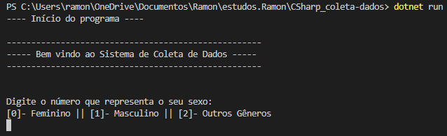
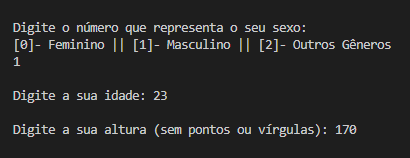
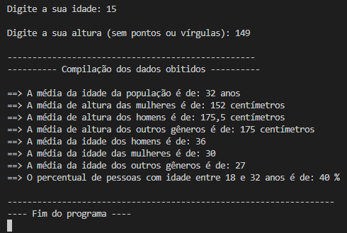

  

## Código - Coleta de Dados de Pessoas 🎲📊

### Linguagem de Programação - C# 

Esse é um Sistema de Coleta de Dados de Pessoas, tais como: idade, sexo e altura. Ao final o programa mostra na tela as informações relevantes sobre a compilação dos dados obtidos. O código foi desenvolvido utilizando a linguagem de programação <strong>C#</strong>. Programa proposto como atividade na faculdade.

- [x] Elaboração de um programa para coletar dados de pessoas
  
## Compilação 👨🏽‍💻

### Preview - Tela inicial código ▶

  

### Preview - Inserindo dados no sistema 💻⬅

  

- [x] Para facilitar a representação foi inserido dados de 5 pessoas:  
  
  |   Gênero   |  Idade  |  Altura (cm) |
  |------------|---------|--------------|
  |  Masculino |    23   |      170     |
  |  Feminino  |    45   |      155     |
  |  Masculino |    50   |      181     |
  |   Outros   |    27   |      175     |
  |  Feminino  |    15   |      149     |

## Preview - Compilação dos dados obtidos 👨🏽‍💻

  

## Tecnologias 🛠

- DotNet
- C# 

## Autor 🎨

- <a target="_blank" href="https://www.linkedin.com/in/ramon-barreto-076191180/">Ramon Barreto</a>

## Contato 📲

- Email: ramon_barreto_medrado@hotmail.com

